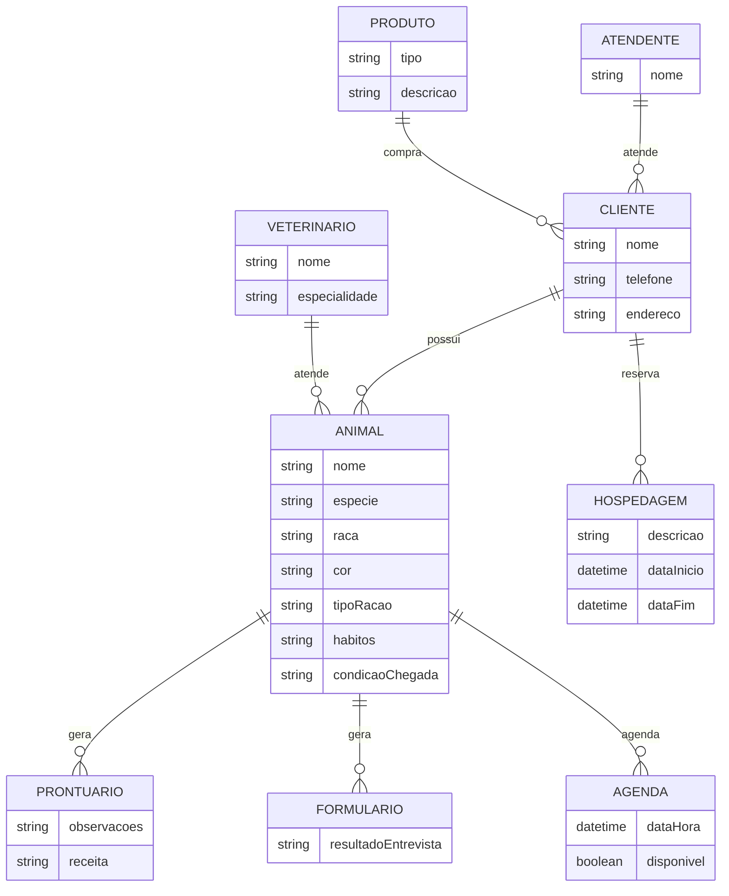
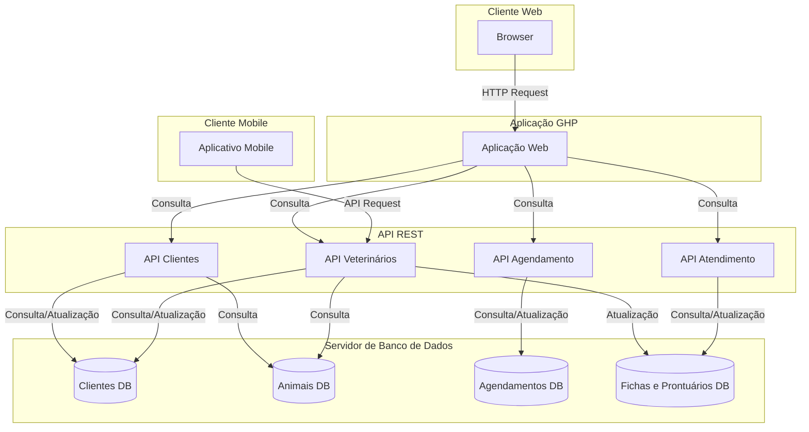

# 1. Descrição do Sistema

Exercício 1:
O nome da clinica é cachorro amarelo

A seguir temos informações sobre um clinica veterinária

1 Uma clínica veterinária atende apenas os animais: gatos e cachorros. 

2 Os clientes devem fazer um cadastro de si e dos animais. 

3 Os clientes devem informar as condições nas quais os animais chegam. 

4 Os clientes devem informar o tipo de ração que o animal come. 

5 O cliente deve informar hábitos do animal. 
6 Para cada animal é possível que mais de um veterinário o atenda. 

7 Os animais podem chegar e serem atendidos de acordo com uma agenda do dia.

8 Cada animal atendido receberá uma ficha e um prontuário. 

9 Outros donos podem querer marcar horários de atendimento futuro.

10 O atendimento gera uma receita para o animal.

11 Quando um cliente chega na clínica veterinária ele é atendido por um atendente.

12 O atendente deve verificar se existe agenda disponível com um veterinário.

13 O atendente deve colocar o cliente e seu animal na fila de espera, se for o caso. 

14 O atendente deve levar o cliente e o animal até o veterinário. 

15 O veterinário deve realizar uma entrevista com o dono do animal. 

16 O resultado da entrevista deve ir para um formulário. 

17 O veterinário deverá examinar o animal e anotar em prontuário(ficha) suas observações. 

18 Dependendo da situação do animal este receberá uma receita.

19 O horário de Atendimento de Segunda a Sexta das 8 às 18:00 hrs.

20 Todo animal precisa ser pesado assim que chega à clínica.

21 A Clinica tem uma loja de produtos para cães e gatos.

22 A pet shop vende ração, apetrechos,roupas e brinquedos para os pets.

23 A Clinica tem um programa de hospedagem.

# 2. Diagrama de Banco de Dados

# 3. Diagrama de Casos de Uso

# 4. Principais Telas do Sistema

# 5. Arquitetura de Sistema

